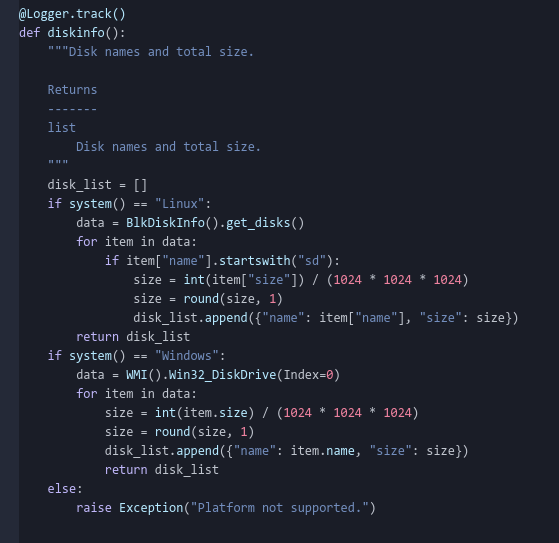

# neko-syntax theme

  

A beautiful modern looking cold pastel color palette on a dark blue-gray background. Tested for Python language.

  

Put some freshness in your code with this cool color palette. Gain confidence by focusing on the quality of your Python code. It adapts to your favorite ui. Or simply from the "One Dark" ui theme.

## Colors

very-light-gray: `#c0c5ce`

light-gray: `#434b65`

gray: `#2f3446`

dark-gray: `#242937`

background: `#1a1d27`

cyan: `#b6e9ff`

blue: `#738ebd`

purple: `#c0b7f9`

red: `#ee829f`

yellow: `#ffefcc`

  

## Installation

From your best editor Atom, Preferences/Settings > Install > Themes, and search for Neko Syntax Theme. Or install through CLI

    apm install neko-syntax
